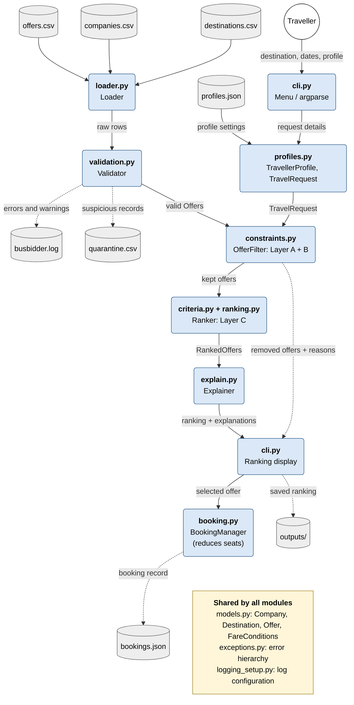

```mermaid
flowchart TB
    user((Traveller))
    cliIn("<b>cli.py</b><br/>Menu / argparse")
    profilesjson[(profiles.json)]
    offers[(offers.csv)]
    companies[(companies.csv)]
    destinations[(destinations.csv)]

    profiles("<b>profiles.py</b><br/>TravellerProfile, TravelRequest")
    loader("<b>loader.py</b><br/>Loader")
    validator("<b>validation.py</b><br/>Validator")
    log[(busbidder.log)]
    quarantine[(quarantine.csv)]

    filter("<b>constraints.py</b><br/>OfferFilter: Layer A + B")
    ranker("<b>criteria.py + ranking.py</b><br/>Ranker: Layer C")
    explainer("<b>explain.py</b><br/>Explainer")

    cliOut("<b>cli.py</b><br/>Ranking display")
    booking("<b>booking.py</b><br/>BookingManager<br/>(reduces seats)")
    bookings[(bookings.json)]
    outputs[(outputs/)]

    user -- destination, dates, profile --> cliIn
    cliIn -- request details --> profiles
    profilesjson -- profile settings --> profiles
    offers --> loader
    companies --> loader
    destinations --> loader
    loader -- raw rows --> validator
    validator -. errors and warnings .-> log
    validator -. suspicious records .-> quarantine
    profiles -- TravelRequest --> filter
    validator -- valid Offers --> filter
    filter -- kept offers --> ranker
    ranker -- RankedOffers --> explainer
    filter -. removed offers + reasons .-> cliOut
    explainer -- ranking + explanations --> cliOut
    cliOut -- selected offer --> booking
    booking -. booking record .-> bookings
    cliOut -. saved ranking .-> outputs

    SHARED["<b>Shared by all modules</b><br/>models.py: Company, Destination, Offer, FareConditions<br/>exceptions.py: error hierarchy<br/>logging_setup.py: log configuration"]
    booking ~~~ SHARED

    classDef file fill:#eeeeee,stroke:#666666,color:#000000
    classDef module fill:#dbe8f7,stroke:#2f5d8a,color:#000000
    classDef person fill:#ffffff,stroke:#000000,color:#000000
    classDef shared fill:#fff6d9,stroke:#a08020,color:#000000
    class offers,companies,destinations,profilesjson,log,quarantine,bookings,outputs file
    class cliIn,cliOut,loader,validator,profiles,filter,ranker,explainer,booking module
    class user person
    class SHARED shared
```
