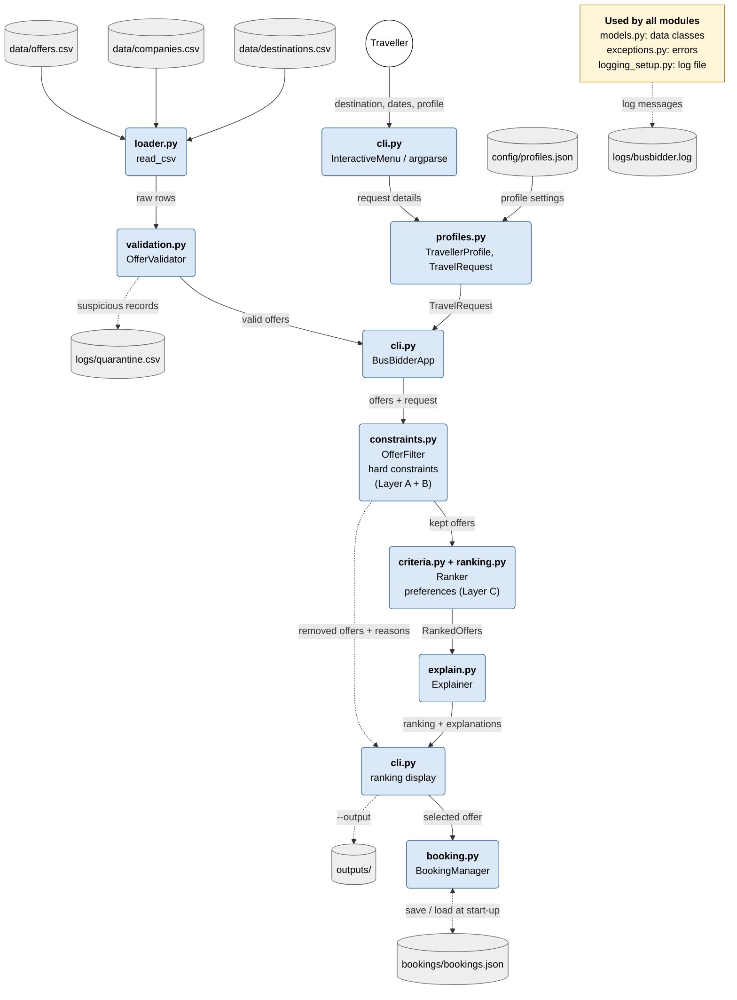

# Architecture and data flow

```mermaid
flowchart TB
    user((Traveller))
    offers[(data/offers.csv)]
    companies[(data/companies.csv)]
    destinations[(data/destinations.csv)]
    profilesjson[(config/profiles.json)]

    cliIn("<b>cli.py</b><br/>InteractiveMenu / argparse")
    loader("<b>loader.py</b><br/>read_csv")
    validator("<b>validation.py</b><br/>OfferValidator")
    quarantine[(logs/quarantine.csv)]
    profiles("<b>profiles.py</b><br/>TravellerProfile, TravelRequest")
    app("<b>cli.py</b><br/>BusBidderApp")
    filter("<b>constraints.py</b><br/>OfferFilter<br/>hard constraints<br/>(Layer A + B)")
    ranker("<b>criteria.py + ranking.py</b><br/>Ranker<br/>preferences (Layer C)")
    explainer("<b>explain.py</b><br/>Explainer")
    cliOut("<b>cli.py</b><br/>ranking display")
    outputs[(outputs/)]
    booking("<b>booking.py</b><br/>BookingManager")
    bookings[(bookings/bookings.json)]

    SHARED["<b>Used by all modules</b><br/>models.py: data classes<br/>exceptions.py: errors<br/>logging_setup.py: log file"]
    log[(logs/busbidder.log)]

    user -- destination, dates, profile --> cliIn
    cliIn -- request details --> profiles
    profilesjson -- profile settings --> profiles
    offers --> loader
    companies --> loader
    destinations --> loader
    loader -- raw rows --> validator
    validator -. suspicious records .-> quarantine
    validator -- valid offers --> app
    profiles -- TravelRequest --> app
    app -- offers + request --> filter
    filter -- kept offers --> ranker
    ranker -- RankedOffers --> explainer
    filter -. removed offers + reasons .-> cliOut
    explainer -- ranking + explanations --> cliOut
    cliOut -. --output .-> outputs
    cliOut -- selected offer --> booking
    booking <-. save / load at start-up .-> bookings
    SHARED -. log messages .-> log

    classDef file fill:#eeeeee,stroke:#666666,color:#000000
    classDef module fill:#dbe8f7,stroke:#2f5d8a,color:#000000
    classDef person fill:#ffffff,stroke:#000000,color:#000000
    classDef shared fill:#fff6d9,stroke:#a08020,color:#000000
    class offers,companies,destinations,profilesjson,log,quarantine,bookings,outputs file
    class cliIn,cliOut,loader,validator,profiles,app,filter,ranker,explainer,booking module
    class user person
    class SHARED shared
```
