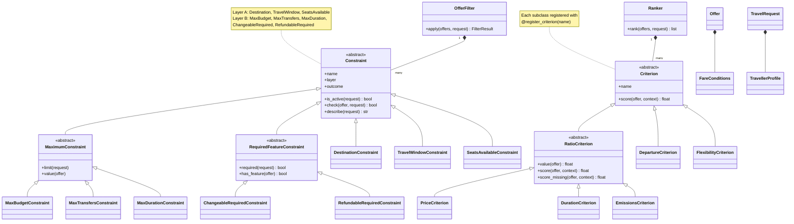

```mermaid
classDiagram
    direction TB

        class Constraint {
        <<abstract>>
        +name
        +layer
        +outcome
        +is_active(request) bool
        +check(offer, request) bool
        +describe(request) str
    }
    class MaximumConstraint {
        <<abstract>>
        +limit(request)
        +value(offer)
    }
    class RequiredFeatureConstraint {
        <<abstract>>
        +required(request) bool
        +has_feature(offer) bool
    }
    class OfferFilter {
        +apply(offers, request) FilterResult
    }
    OfferFilter "1" *-- "many" Constraint

    Constraint <|-- DestinationConstraint
    Constraint <|-- TravelWindowConstraint
    Constraint <|-- SeatsAvailableConstraint
    Constraint <|-- MaximumConstraint
    Constraint <|-- RequiredFeatureConstraint
    MaximumConstraint <|-- MaxBudgetConstraint
    MaximumConstraint <|-- MaxTransfersConstraint
    MaximumConstraint <|-- MaxDurationConstraint
    RequiredFeatureConstraint <|-- ChangeableRequiredConstraint
    RequiredFeatureConstraint <|-- RefundableRequiredConstraint

    class Criterion {
        <<abstract>>
        +name
        +score(offer, context) float
    }
    class RatioCriterion {
        <<abstract>>
        +value(offer) float
        +score(offer, context) float
        +score_missing(offer, context) float
    }
    class Ranker {
        +rank(offers, request) list
    }
    Ranker "1" *-- "many" Criterion

    Criterion <|-- RatioCriterion
    RatioCriterion <|-- PriceCriterion
    RatioCriterion <|-- DurationCriterion
    RatioCriterion <|-- EmissionsCriterion
    Criterion <|-- DepartureCriterion
    Criterion <|-- FlexibilityCriterion

    Offer *-- FareConditions
    TravelRequest *-- TravellerProfile

    note for Constraint "Layer A: Destination, TravelWindow, SeatsAvailable<br>Layer B: MaxBudget, MaxTransfers, MaxDuration,<br>ChangeableRequired, RefundableRequired"
    note for Criterion "Each subclass registered with<br>@register_criterion(name)"
```